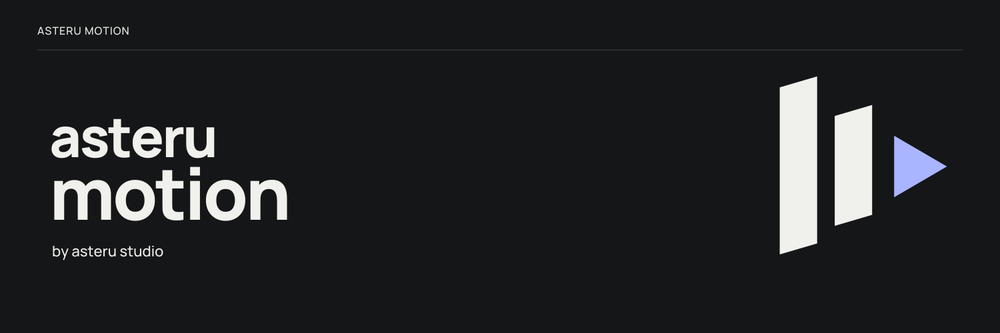
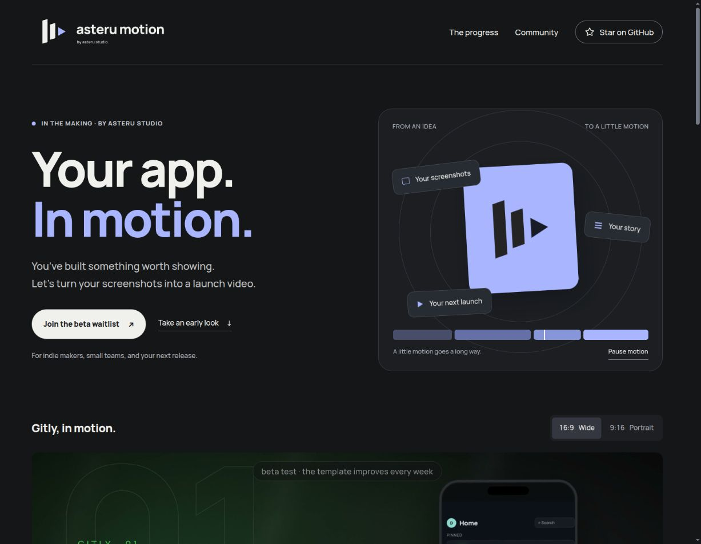
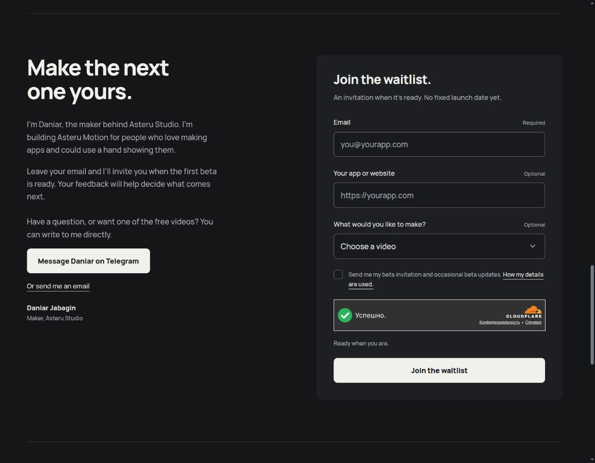
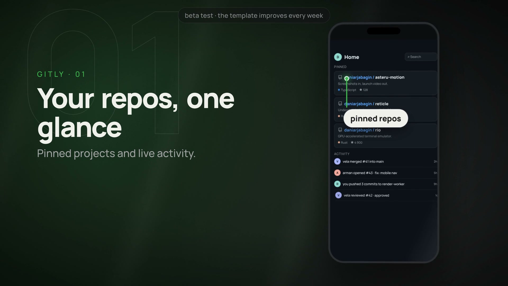

<strong>Your app. In motion.</strong> A little help showing what you’ve built.

<a href="https://asteru-motion.asterustudio.workers.dev/#join"><strong>Join the beta waitlist</strong></a> · <a href="https://asteru-motion.asterustudio.workers.dev/#early-look">Watch a demo</a> · <a href="README.ru.md">По-русски</a>

## Hi, I’m Daniar 👋

I’m building **Asteru Motion** at **Asteru Studio** to help app makers turn their screenshots into short promo videos.

My idea is simple: bring a few screens, tell me what your app does, and shape a video for your launch, a new feature, or a social post.

Here I share progress, plans, and examples. You can ask questions and help me decide what to build next.

## Next up: the beta 🎬

I’m getting the first beta ready. **It isn’t open yet**, but you can [join the waitlist](https://asteru-motion.asterustudio.workers.dev/#join) now. I’ll send an invitation when it’s ready to try.

[See what I’m working towards →](ROADMAP.md)

## Take a look around

I’ve made a small website with demos and a beta waitlist. Tap either screenshot to visit it and leave your email.

A look at the beta signup

[Open the website and join the waitlist →](https://asteru-motion.asterustudio.workers.dev/#join)

## See it in motion

I made this **Gitly demo** to show the kind of launch videos I’m working on. [Watch it in wide or portrait format](https://asteru-motion.asterustudio.workers.dev/#early-look).

## Want a free video for your app?

I’m making free promo videos for **10 app makers**. The first one is delivered — **9 spots are still open**.

[Message me on Telegram](https://t.me/daniarjabagin) with **3 screenshots, your app’s name, and one sentence about it**. I’ll make a video, and your feedback will help me improve Asteru Motion.

You don’t need to wait for the beta to ask for one. Questions are welcome too 🙂

## Follow along 💜

- **Star this repo** if you’d like to support what I’m making.
- [Share an idea](https://github.com/asterustudio/asteru-motion-community/discussions/categories/ideas) or [ask me a question](https://github.com/asterustudio/asteru-motion-community/discussions/categories/q-a).
- [Follow the updates](https://github.com/asterustudio/asteru-motion-community/discussions/categories/announcements), or send the [website](https://asteru-motion.asterustudio.workers.dev/) to another app maker.

This is the public home for the project. I’m developing the app privately; there’s nothing to install from this repo.

---

[Roadmap](ROADMAP.md) · [How to help](CONTRIBUTING.md) · [Support](SUPPORT.md) · [Telegram](https://t.me/daniarjabagin) · [Email](mailto:asterustudio@inbox.ru)

Made by Daniar · **Asteru Studio**
