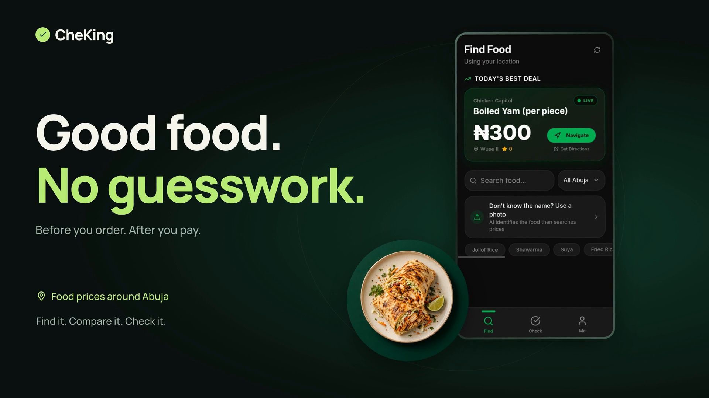

<strong>Твоё приложение — в движении.</strong> Помогу красиво показать то, что ты сделал.

<a href="https://asteru-motion.asterustudio.workers.dev/#join"><strong>Записаться на бету</strong></a> &nbsp; 

<a href="#давай-пообщаемся-">Обсуждения</a> · <a href="https://asteru-motion.asterustudio.workers.dev/#early-look">Посмотреть пример</a> · <a href="README.md">English</a>

## Привет, я Данияр 👋

Делаю **Asteru Motion** в **Asteru Studio**, чтобы из скриншотов приложения было проще собрать короткий промо-ролик.

Идея простая: добавить несколько экранов, рассказать о приложении и собрать видео для запуска, новой функции или поста в соцсетях.

Здесь я делюсь прогрессом, планами и примерами. Можно задавать вопросы и предлагать то, что хочется увидеть в проекте.

## Следующий шаг — бета-тест 🎬

Готовые промо-ролики уже можно посмотреть. **Сейчас я готовлю приложение к первой бете** — с музыкой, широким и вертикальным форматами со старта.

Уже можно [записаться в список ожидания](https://asteru-motion.asterustudio.workers.dev/#join). Когда всё будет готово, я пришлю приглашение.

[Посмотреть полный roadmap →](ROADMAP.ru.md)

## Давай пообщаемся 💬

Буду рад увидеть, что ты делаешь, и узнать, какие ролики хочешь создавать в Asteru Motion. Выбирай тему ниже — можно писать на русском или английском.

| С чего начать | О чём поговорим |
| --- | --- |
| [👋 Показать своё приложение](https://github.com/asterustudio/asteru-motion-community/discussions/3) | Поделись приложением, скриншотом или тем, над чем сейчас работаешь. |
| [💡 Предложить идею](https://github.com/asterustudio/asteru-motion-community/discussions/4) | Расскажи, какой ролик тебе хотелось бы сделать. |
| [❓ Задать вопрос](https://github.com/asterustudio/asteru-motion-community/discussions/categories/q-a) | Спроси меня о приложении, бете или создании промо-ролика. |
| [🎬 Прочитать последнее обновление](https://github.com/asterustudio/asteru-motion-community/discussions/2) | Узнай, что уже готово и над чем я работаю дальше. |

[Открыть все обсуждения →](https://github.com/asterustudio/asteru-motion-community/discussions)

## Загляни на сайт

Я сделал небольшую страницу с примерами видео и записью на бета-тест. Нажми на скриншот, чтобы открыть сайт и оставить свою почту.

Как выглядит запись на бета-тест

[Открыть сайт и записаться на бета-тест →](https://asteru-motion.asterustudio.workers.dev/#join)

## Как это выглядит

Это **CheKing** — первое приложение, для которого я сделал бесплатный промо-ролик. В обновлённой версии подробнее показал весь процесс: сканирование фото, проверку цены и результат. [Посмотреть широкую или вертикальную версию](https://asteru-motion.asterustudio.workers.dev/#early-look).

## Хочешь бесплатный ролик для своего приложения?

Я делаю бесплатные промо-ролики для **10 авторов приложений**. Первый уже отправил — **осталось 9 мест**.

[Напиши мне в Telegram](https://t.me/daniarjabagin): нужны **3 скриншота, название приложения и одно предложение о нём**. Я соберу ролик, а твой отзыв поможет мне улучшить Asteru Motion.

Ждать открытия беты для этого не нужно. Если есть вопросы — тоже пиши 🙂

## Поддержать проект 💜

Я делаю Asteru Motion самостоятельно. Теперь можно поддержать работу через Buy Me a Coffee, а ещё — рассказать о проекте или поделиться обратной связью. Все способы собрал по кнопке ниже.

## Оставайся на связи

- Поставь **звёздочку** репозиторию, если тебе нравится идея.
- Отправь [сайт](https://asteru-motion.asterustudio.workers.dev/) знакомому разработчику, которому пригодится промо-ролик.

Это публичная страница проекта. Само приложение я разрабатываю в закрытом репозитории; устанавливать отсюда ничего не нужно.

---

[План развития](ROADMAP.ru.md) · [Обсуждения](https://github.com/asterustudio/asteru-motion-community/discussions) · [Как помочь](CONTRIBUTING.md) · [Поддержка](SUPPORT.md) · [Telegram](https://t.me/daniarjabagin) · [Почта](mailto:asterustudio@inbox.ru)

Данияр · **Asteru Studio**
