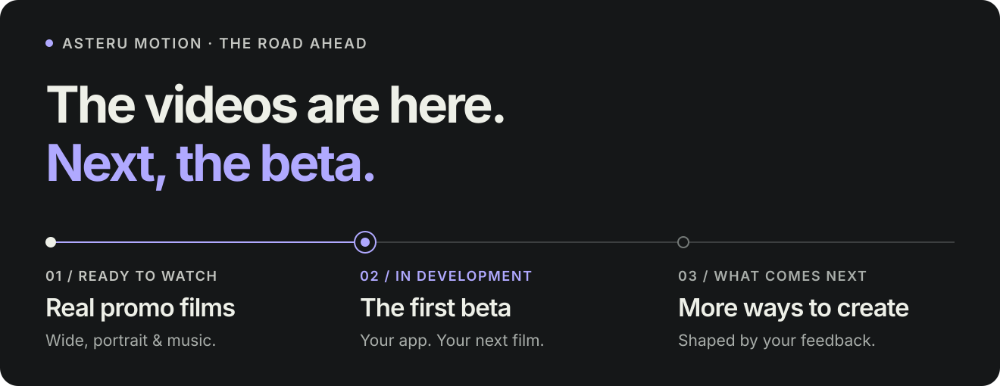

<a href="https://asteru-motion.asterustudio.workers.dev/#join"><strong>Записаться на бета-тест</strong></a> · <a href="https://asteru-motion.asterustudio.workers.dev/#early-look">Посмотреть ролик</a> · <a href="ROADMAP.md">English</a>

# Куда движется Asteru Motion 🎬

Я уже делаю промо-ролики с анимацией экранов приложения, музыкой и версиями для широкого и вертикального формата. В них можно увидеть результат, который я хочу помочь тебе получить в Asteru Motion.

**Сейчас готовлю приложение к первой бете.** Ниже — что в неё войдёт и куда хочу двигаться дальше.

## 01 · Готовые ролики уже есть

**Можно посмотреть сейчас**

В сделанных роликах уже есть то, на чём строится стиль Asteru Motion:

- Настоящие экраны приложения, читаемые заголовки и история под конкретный продукт.
- Плавные переходы и анимированный показ интерфейса, который успеваешь рассмотреть.
- Музыка под настроение и темп ролика.
- Широкие версии **16:9** и вертикальные **9:16**.
- Светлое и тёмное оформление, а также чистые версии, которые автор приложения может использовать.

[Посмотреть демо Gitly →](https://asteru-motion.asterustudio.workers.dev/#early-look)

## 02 · Твой первый ролик в приложении

**В разработке · первая бета**

Ближайшая цель — дать первым авторам приложений собрать собственные видео. В бете хочу объединить весь путь:

| Что войдёт в бету | Что ты сможешь сделать |
| --- | --- |
| **Свои материалы** | Добавить скриншоты и рассказать, на что обратить внимание. |
| **Подходящий сценарий** | Выбрать предложенный вариант или написать свой. |
| **Редактирование сцен** | Поправить текст, скриншоты, порядок и длительность сцен. |
| **Оба формата со старта** | Сделать широкий ролик **16:9** или вертикальный **9:16**. |
| **Музыка** | Выбрать музыку, разрешённую для использования в промо-ролике, и настроить громкость. |
| **Предпросмотр и экспорт** | Посмотреть результат, внести правки и скачать готовый MP4. |

**Музыка и оба формата обязательно войдут в первую бету.** Готовлю их вместе с редактором и экспортом.

До первых приглашений хочу добиться простого результата: человек добавляет свои скриншоты, понимает следующий шаг и получает ролик. А если что-то идёт не так — его работа сохраняется.

[Записаться на бета-тест →](https://asteru-motion.asterustudio.workers.dev/#join)

## 03 · Улучшаем бету вместе

**Следом · с первыми участниками**

Сначала приглашу небольшую группу, помогу с первыми роликами и узнаю, что понравилось, а что оказалось неудобным.

- Исправлю места, где люди застревают.
- Доработаю темп, расположение текста и показ экранов.
- Сделаю предпросмотр и экспорт надёжнее.
- Буду приглашать больше людей по мере улучшения приложения.

О том, что изменил и почему, буду писать в [новостях проекта](https://github.com/asterustudio/asteru-motion-community/discussions/categories/announcements).

## 04 · Больше способов рассказать о приложении

**После первой беты · по отзывам**

| Направление | Для чего |
| --- | --- |
| **Новые стили** | Выбрать оформление для спокойного демо, яркого запуска или новой функции. |
| **Начать со ссылки** | Получить материалы с публичной страницы приложения, проверить их и выбрать нужные. |
| **Приложение в работе** | Добавить запись экрана, выбрать интересные моменты и совместить их со скриншотами. |
| **Более длинные истории** | Собрать подробный обзор или объяснение функции продолжительностью до трёх минут. |
| **Настройки экспорта** | Выбрать 60 fps и 4K, когда материалы и сервис экспорта позволяют получить хороший результат. |

Порядок буду выбирать по реальным запросам и готовности приложения. Платные варианты экспорта появятся, когда разберусь со стоимостью и пойму, что полезно участникам беты.

## Помоги выбрать следующий шаг 💜

Расскажи о своём приложении и ролике, который хотел бы сделать. Озвучка, субтитры и другие идеи тоже можно обсудить.

[Предложить идею](https://github.com/asterustudio/asteru-motion-community/discussions/categories/ideas) · [Показать приложение](https://github.com/asterustudio/asteru-motion-community/discussions/categories/show-and-tell) · [Задать вопрос](https://github.com/asterustudio/asteru-motion-community/discussions/categories/q-a)

---

**Сейчас главное — первая бета.** Она ещё в разработке, дату запуска я пока не объявлял. Буду обновлять эту страницу по мере готовности.

[Вернуться к Asteru Motion](README.ru.md) · [Поддержать проект](SUPPORT.md)
